<h1 align="center">Sistema RT "Radio Taxi"</h1>

This project was generated with [Angular CLI](https://github.com/angular/angular-cli) version 17.3.6  and all dependencies are in the `package.json` file.

### Component structure

    

    
For all.

    

    
For mobile mode.
 

    

    
For desktop mode.
 

```mermaid
graph v
    A((Structure)) --> B((Header))
    A --> C((Main))
    A --> D((Footer))
    A --> E((Backdoor))
    A --> F((Drawer))
    B --> G((Logo))
    B --> H((Menu))
    B --> I((Burger))
    style A fill: #E91E63, stroke: #FF8A80, stroke-width: 2px
    style B fill: #E91E63, stroke: #FF8A80, stroke-width: 2px
    style C fill: #E91E63, stroke: #FF8A80, stroke-width: 2px
    style D fill: #E91E63, stroke: #FF8A80, stroke-width: 2px
    style E fill: #004D40, stroke: #00ACC1, stroke-width: 2px
    style F fill: #004D40, stroke: #00ACC1, stroke-width: 2px
    style G fill: #E91E63, stroke: #FF8A80, stroke-width: 2px
    style H fill: #FF8F00, stroke: #FFE57F, stroke-width: 2px
    style I fill: #004D40, stroke: #00ACC1, stroke-width: 2px
```

### App colors

- `#55565a`.
- `#f98f00`.
- `#f2d082`.
- `#2e3349`.
- `#ffa500`.
- `#ffffff`.

    

    

    

    

    

    

   

